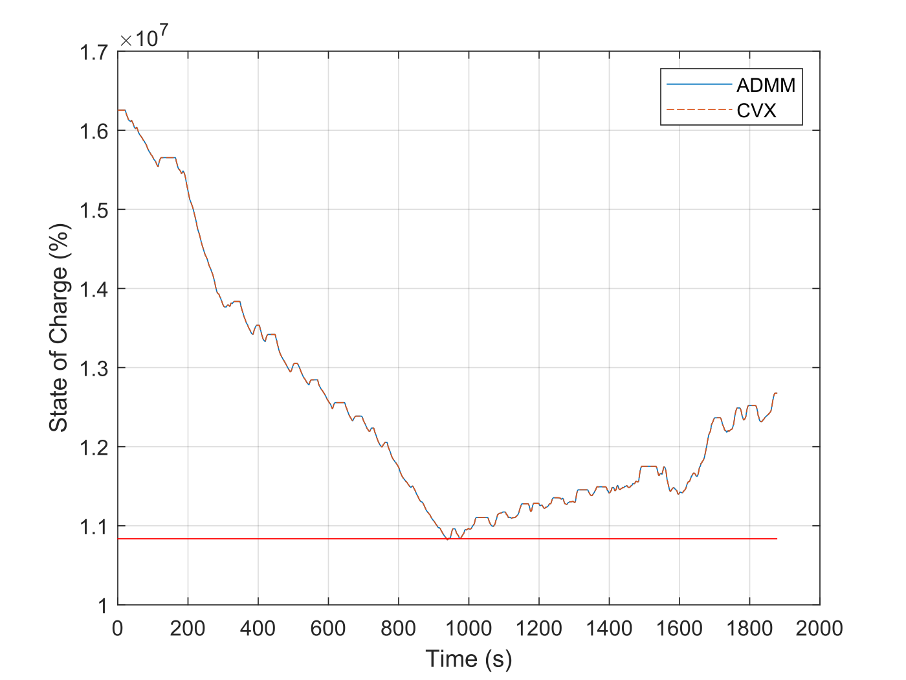

# admm-energy-management
An ADMM solver for _convex_ energy management problems in plug-in hybrid electric vehicles. The ADMM algorithm is explained in detail in the paper:

[[1] Energy Management in Plug-in Hybrid Electric Vehicles: Convex Optimization Algorithms for Model Predictive Control](https://ieeexplore.ieee.org/document/8816673)

A preprint is also freely available [here](https://arxiv.org/abs/1902.07728).

The code in this repository is free to use for any purpose, but if this work is helpful towards your published research I would greatly appreciate it if you cite [2]. 

# File descriptions

This respository contains the following files:

- __d_inputs.mat -__ A Matlab data file that contains the inputs for the solver
- __f_ADMM.m -__ The ADMM energy management solver as a Matlab function file
- __f_CVX.m -__ An equivalent CVX solver as a Matlab function file
- __f_BacktrackingNewtonVector.m -__ A function for performing one of the ADMM variable updates
- __s_run.m -__ A script for running both the ADMM and CVX solvers. This script will skip the CVX optimization if it is not available.
- __figure.svg -__ A figure of the results of the optimizations

# Input data

Unfortunately, I could not make the entire simulations included in [1] publicly available as the engine and motor data is proprietary. The __d_inputs.mat__ files therefore contain the inputs to the ADMM solver (generated using the method detailed in section X in [1]) for the FTP75 drive cycle. The __d_inputs.mat__ file contains the following data (where N is the duration of the FTP75 cycle in seconds):

- __coeffs -__ A Nx6 array where the columns correspond to the alpha and beta values as 1=alpha2, 2=alpha1, 3=alpha0, 4=beta2, 5=beta1, 6=beta0.
- __Elowerlim -__ The lower limit on the battery's energy in joules (scalar).
- __Eupperlim -__ The upper limit on the bettery's energy in joules (scalar).
- __Estart -__ The battery's initial energy for the energy management optimization (scalar).
- __Pbmax -__ A Nx1 array of upper limits on battery power
- __Pbmin -__ A Nx1 arrray of lower limits on battery power
- __Pdrv -__ A Nx1 array of driver's demand power
- __P -__ An array of indexes where the engine is on and delivering power
- __C -__ An array of indexes where the engine is on but the clutch is disengaged
- __R -__ The open circuit resistance of the battery
- __V -__ The open circuit voltage of the battery

# Results

The figure that is generated by running the __s_run.m__ script is shown below, where the ADMM results exactly match the CVX results. When running the script on a 2.60GHz Intel Core i7 processor, the ADMM code took approximately __0.6s__, whereas CVX took approximately 

